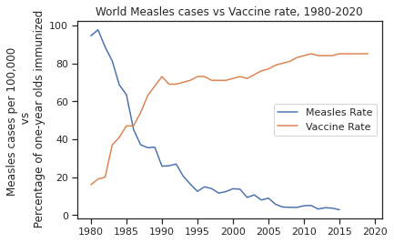
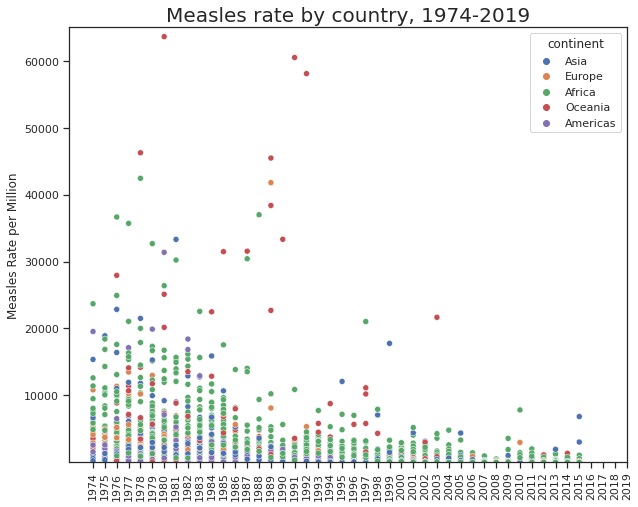
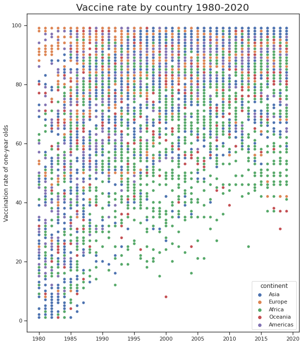

## Data Visualization 

MEASLES -vs- VACCINE ANALYSIS 
SAM COOGAN, ANUSHKA WALSEPATIL 
DUBLIN CITY UNIVERSITY, IRELAND 

This line plot shows how cases of measles declined as vaccines were introduced. 
It must be noted that vaccines/immunization was administered to one-year old babies, this is why the measles cases declined over time. 
 

Cases of measles were most prominent in Oceania, Africa. Despite this wealthier countries such as those in Europe had higher initial vaccine rate despite relatively few measles cases by comparison.

